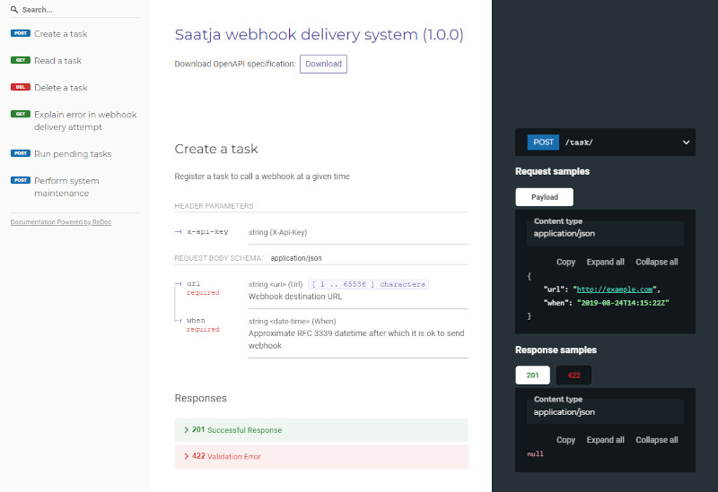

.. image:: https://travis-ci.com/lietu/saatja.svg?branch=master
    :target: https://travis-ci.com/lietu/saatja

.. image:: https://img.shields.io/badge/code%20style-black-000000.svg
    :target: https://github.com/psf/black

.. image:: https://codecov.io/gh/lietu/saatja/branch/master/graph/badge.svg
    :target: https://app.codecov.io/gh/lietu/saatja/branch/master

.. image:: https://img.shields.io/docker/pulls/lietu/saatja
    :target: https://hub.docker.com/r/lietu/saatja

.. image:: https://img.shields.io/github/issues/lietu/saatja
    :target: https://github.com/lietu/saatja/issues
    :alt: GitHub issues

.. image:: https://img.shields.io/badge/License-BSD%203--Clause-blue.svg
    :target: https://opensource.org/licenses/BSD-3-Clause

.. code-block::

    🇪🇪 Saatja (Estonian)
    🇺🇸 Sender (English)

    System to deliver webhooks cost-effectively

What is this?
=============

The main goal is to have a tool that can deliver webhooks effectively, ensuring retries are taken care of in case of issues, and cost-efficient deployment.

Primarily intended to be deployed to Google Cloud Run with Google Cloud Scheduler triggering it once per minute, but other deployments may be supported too with some changes.

API Docs
--------

View the API docs for Saatja at `https://lietu.github.io/saatja/ <https://lietu.github.io/saatja/>`_.

Google Cloud Run Deployment
---------------------------

This is the primary intended way of deployment. Google Cloud Run is a very cost-efficient way of building scalable web applications as you only pay for CPU time used for processing requests, and it scales automatically. Read more about Google Cloud Run at `https://cloud.google.com/run <https://cloud.google.com/run>`_

You will need the Google Cloud SDK installed for these instructions, but you can perform this manually through the Google Cloud Console as well. Check `https://cloud.google.com/sdk/docs/install <https://cloud.google.com/sdk/docs/install>`_ for installation instructions.

Cloud Run unfortunately cannot directly pull images from Docker Hub, so you need to pull and push to your own registry.

.. code-block:: bash

    gcloud login
    gcloud config set project <your-gcp-project-name>

    gcloud auth configure-docker
    docker pull lietu/saatja:latest

    # Check registry URLs https://cloud.google.com/container-registry/docs/overview#registries_registries
    docker tag lietu/saatja:latest ([eu|us|asia].)gcr.io/your-google-project/saatja:latest
    docker push ([eu|us|asia].)gcr.io/your-google-project/saatja:latest

    # Check https://cloud.google.com/about/locations for regions with Cloud Run support
    gcloud run deploy saatja \
        --image ([eu|us|asia].)gcr.io/your-google-project/saatja:latest \
        --region europe-west1 \
        --platform managed \
        --allow-unauthenticated \
        --set-env-vars= "^@^API_KEYS=api,key,list@WEBHOOK_PREFIXES=https://,and,so,on"

The environment variables you can set are:

.. code-block::

    API_KEYS=api,key,list  # Accepted keys for X-Api-Key header for Task APIs
    WEBHOOK_PREFIXES=https://some.url  # Optional limit for allowed webhook prefixes for security
    DB_COLLECTION_PREFIX=saatja  # If you want the Firestore collections to be prefixed in a shared GCP project
    GCLOUD_PROJECT=project-name  # You should set this to your Google Cloud project name for logging to work properly

You may want to check out `cloudbuild-saatja.yaml <./cloudbuild-saatja.yaml>`_ for an example on how to automate this via `Google Cloud Build <https://cloud.google.com/cloud-build>`_.

Saatja should be triggered by Cloud Scheduler every minute, you can either configure that manually at `https://console.cloud.google.com/cloudscheduler <https://console.cloud.google.com/cloudscheduler>`_ or via the gcloud CLI.

.. code-block:: bash

    # You will need the gcloud alpha commands for this
    gcloud components install alpha

    # The URI should be your Cloud Run deployment URL
    gcloud alpha scheduler jobs create http \
        saatja-run-tasks \
        --schedule="* * * * *" \
        --uri=https://saatja-x.a.run.app/scheduler/run-tasks \

You can create a webhook task to be delivered via the ``POST /task/`` endpoint, so e.g.:

.. code-block:: bash

    curl -X POST https://saatja-x.a.run.app/task/ \
        -H 'Content-Type: application/json; charset=utf-8' \
        --data-binary @- <<'END'
    {
        "url": "https://localhost/webhook/test",
        "when": "2002-02-02T19:19:19Z",
        "payload": {
            "status": "ok",
            "items": 7,
            "nest": {
                "yes": true
            }
        }
    }
    END

For details check the `API docs <https://lietu.github.io/saatja/>`_.

Development
-----------

Running locally requires a Google Cloud Firestore emulator running locally in a predictable port. When you have the Google Cloud SDK installed as per instructions above you can run:

.. code-block:: bash

    gcloud components install beta cloud-firestore-emulator

    # then
    ./start_emulator.sh
    # or on Windows
    start_emulator.bat

Then to run Saatja in development mode, you can simply run it with `Poetry <https://python-poetry.org/docs/#installation>`_ as follows:

.. code-block:: bash

    poetry install
    poetry run saatja-dev

To run the unit tests use `Pytest <https://docs.pytest.org/en/stable/>`_:

.. code-block:: bash

    poetry run pytest

Before committing anything make sure you run `pre-commit <https://pre-commit.com>`_ in the repository.

.. code-block:: bash

    pre-commit install

    # If you've done changes before running the above command
    pre-commit run --all-files

TODO: It would be real nice if we had a way to emulate the Scheduler calls once per minute locally in development mode.

License
-------

Licensing is important. This project itself uses BSD 3-clause license, but other libraries used by it may have their own licenses.

For more information check the `LICENSE <https://github.com/lietu/saatja/blob/master/LICENSE>`_ -file.

Contributing
============

This project is run on GitHub using the issue tracking and pull requests here. If you want to contribute, feel free to `submit issues <https://github.com/lietu/saatja/issues>`_ (incl. feature requests) or PRs here.

Financial support
=================

This project has been made possible thanks to `Cocreators <https://cocreators.ee>`_ and `Lietu <https://lietu.net>`_. You can help us continue our open source work by supporting us on `Buy me a coffee <https://www.buymeacoffee.com/cocreators>`_.

.. image:: https://www.buymeacoffee.com/assets/img/custom_images/orange_img.png
   :target: https://www.buymeacoffee.com/cocreators

